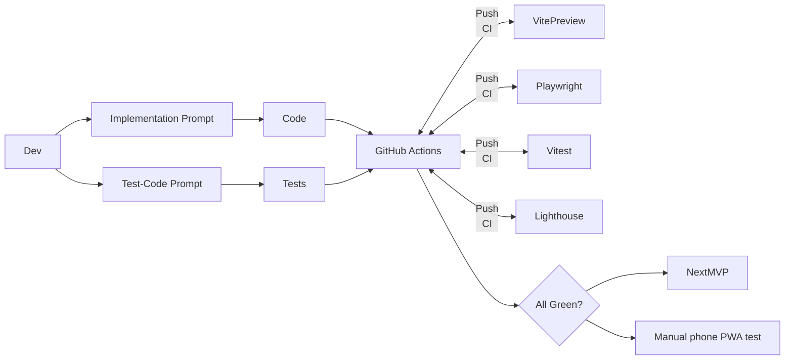

# Perfect Zenkai — Incremental MVP Backlog

Each MVP is a **vertical slice** that delivers user value and leaves the repo in a green‑test state.

## What You Get for Each User Story

- **User Story** – business language description
- **Acceptance Criteria** – "definition of done"
- **Test Cases** – what automated checks must pass
- **Implementation Prompt** – copy‑paste into Cursor/Claude to generate code
- **Test‑Code Prompt** – copy‑paste to generate matching unit/UI/e2e tests

> **Architecture Rule:** Modules may import **shared** but **never each other**. Shell imports only module **routes**.  
> **Vibe‑coding best‑practice notes appear in _italics_ like this.**  
> They are optional enhancements the agent may include.

---

## MVP 0 — Environment & Skeleton

### 0.1 Init Toolkit

**User Story:** _As a dev I want a wired repo so I can `pnpm dev` and see a blank app._

**Acceptance Criteria:**

- `pnpm dev`, `pnpm test`, `pnpm lint` exit 0
- Prettier & ESLint configs present
- Folder structure follows solution design: `src/app/`, `src/modules/`, `src/shared/`, `src/types/`, `src/test/`

**Test Cases:** CLI checks

**Implementation Prompt:**

```
Create a Vite + React18 + TypeScript project named perfect-zenkai. Add Tailwind 3, shadcn/ui, lucide-react, @vite-pwa/react, ESLint, Prettier, Vitest, Husky, lint‑staged.

Create folder structure:
src/
├─app/ (AppShell.tsx, routes.ts, NavigationBar.tsx, GlobalFab.tsx)
├─modules/ (weight/, tasks/, dashboard/)
├─shared/ (ui/, hooks/, lib/)
├─types/
└─test/

Return package.json, vite.config.ts, tailwind.config.ts, src/main.tsx (empty <App/>).
```

**Test‑Code Prompt:**

```
Generate src/test/setupTests.ts and src/__tests__/sanity.test.ts that asserts true === true using Vitest.
```

---

### 0.2 PWA Shell

**User Story:** _App is installable and dark‑themed with Perfect Zenkai branding._

**Acceptance Criteria:**

- `manifest.json` (name "Perfect Zenkai", short_name "Zenkai", icons 192/512, theme #111827)
- Service‑worker registered via @vite-pwa/react
- Lighthouse PWA ≥ 90

**Test Cases:** Lighthouse CI run

**Implementation Prompt:**

```
Add PWA manifest with name "Perfect Zenkai", short_name "Zenkai", theme_color "#111827", background_color "#111827". Generate 192x192 and 512x512 icons. Register service‑worker via virtual:pwa-register in main.tsx. Update index.html theme‑color=#111827. Configure @vite-pwa/react with Workbox.
```

**Test‑Code Prompt:**

```
Create scripts/lighthouse.mjs with @lhci/cli preset=pwa, fail if score<90. Add npm script "lighthouse".
```

---

### 0.3 App Chrome

**User Story:** _Header shows "Perfect Zenkai", empty bottom nav, and inactive FAB are visible._

**Acceptance Criteria:**

- Header uses shadcn CardHeader with title "Perfect Zenkai"
- Bottom nav uses shadcn NavigationBar fixed `bottom‑0 inset‑x‑0`
- FAB uses Tailwind `fixed bottom-20 right-4 w-14 h-14 rounded-full` with opacity-60
- Layout renders on desktop & phone

**Test Cases:** Playwright bbox snapshot

**Implementation Prompt:**

```
Build src/app/AppShell.tsx with:
- Header using shadcn CardHeader, title "Perfect Zenkai"
- NavigationBar component (empty items) fixed bottom‑0 inset‑x‑0
- GlobalFab component fixed bottom-20 right-4 w-14 h-14 rounded-full bg-primary opacity-60
- Main content area with proper spacing
Use shadcn primitives and Tailwind. Create NavigationBar.tsx and GlobalFab.tsx as separate components.
```

**Test‑Code Prompt:**

```
Playwright test src/test/AppShell.spec.ts — open /, assert Header text "Perfect Zenkai", Nav, Fab visible (boundingBox).
```

---

### 0.4 LAN Docs

**User Story:** _I know how to open the dev app on my phone._

**Acceptance Criteria:**

- README updated with `pnpm dev -- --host` steps and QR tip

**Test Cases:** –

**Implementation Prompt:**

```
Append a "Mobile Testing" section to README.md explaining:
1. `pnpm dev -- --host` to expose on LAN
2. `npx qrencode -t terminal http://YOUR_IP:5173` for QR code
3. Chrome mobile "Install app" option
```

**Test‑Code Prompt:** –

---

## **AGENTIC AI SYSTEM MVPs** 🤖

### MVP-26 — Food Analysis Agent ✅ **COMPLETED**
**Agent:** Analyze meal photos using GPT-4o-mini vision AI, identify foods, estimate calories, auto-populate meal entry forms
**Status:** Production-ready with photo upload, AI analysis, nutrition validation, and agentic chat integration

### MVP-27 — Weight Management Agent 📋 **PLANNED**
**Agent:** Smart weight analytics, goal recommendations, predictive modeling, and conversational weight coaching
**Features:** Trend analysis, goal intelligence, progress forecasting, natural language weight management

### MVP-28 — Task Productivity Agent 📋 **PLANNED**
**Agent:** Intelligent task prioritization, scheduling optimization, productivity insights, and workflow coaching
**Features:** Smart prioritization, productivity analytics, scheduling intelligence, conversational task management

### MVP-29 — Workout & Fitness Agent 📋 **PLANNED**
**Agent:** Personalized workout planning, exercise progression, form guidance, and adaptive fitness coaching
**Features:** Workout generation, progress tracking, coaching intelligence, conversational fitness support

### MVP-30 — Journal & Mental Wellness Agent 📋 **PLANNED**
**Agent:** Emotional analysis, mood tracking, wellness coaching, and mental health pattern recognition
**Features:** Sentiment analysis, wellness coaching, pattern recognition, conversational emotional support

### MVP-31 — Goals & Achievement Agent 📋 **PLANNED**
**Agent:** SMART goal optimization, progress intelligence, motivation coaching, and achievement prediction
**Features:** Goal optimization, progress tracking, motivation coaching, conversational goal management

### MVP-32 — Notes & Knowledge Agent 📋 **PLANNED**
**Agent:** Intelligent note organization, semantic search, knowledge extraction, and insight synthesis
**Features:** Smart organization, semantic search, knowledge extraction, conversational knowledge queries

### MVP-33 — Health Analytics Agent 📋 **PLANNED**
**Agent:** Comprehensive health insights, cross-module correlation analysis, predictive health modeling
**Features:** Holistic dashboard, correlation analysis, predictive modeling, conversational health analytics

### MVP-34 — Standup Conversation Agent 📋 **PLANNED**
**Agent:** Voice-powered morning standup and nightly review conversations with text-to-speech interaction
**Features:** Speech recognition/synthesis, morning planning flow, nightly reflection flow, intelligent conversation management

---

## MVP 1 — Test‑Suite Foundation

### 1.1 Vitest Harness

**User Story:** _I can unit‑test hooks & components easily with proper providers._

**Acceptance Criteria:**

- `src/test/setupTests.ts` registers RTL + jest‑dom
- `renderWithProviders()` helper adds MemoryRouter + Zustand + Dexie providers
- Coverage gate ≥ 80%
- JSDOM environment configured

**Test Cases:** `pnpm test --coverage` ≥ 80%

**Implementation Prompt:**

```
Create vitest.config.ts with:
- JSDOM environment
- Coverage threshold 80%
- setupFiles pointing to src/test/setupTests.ts

Create src/test/setupTests.ts importing @testing-library/jest-dom.

Implement renderWithProviders(children) wrapper that provides:
- MemoryRouter from react-router-dom
- Zustand store providers (when they exist)
- Any Dexie database providers
```

**Test‑Code Prompt:**

```
Create src/test/Sample.test.tsx — render <button>Hi</button> with renderWithProviders and expect text "Hi" to be in document.
```

---

### 1.2 Playwright Harness

**User Story:** _I can run e2e tests in mobile viewport automatically._

**Acceptance Criteria:**

- playwright.config.ts default viewport 375×667 & baseURL=http://localhost:5173
- `pnpm test:e2e` spins dev server automatically
- Mobile-first testing approach

**Test Cases:** Sample spec passes

**Implementation Prompt:**

```
Add @playwright/test dependency. Create playwright.config.ts with:
- Mobile viewport 375×667
- baseURL http://localhost:5173
- webServer config to start Vite dev server automatically
- Projects for chromium mobile

Add npm script "test:e2e": "playwright test"
```

**Test‑Code Prompt:**

```
Create e2e/sample.spec.ts — goto '/', expect Header text "Perfect Zenkai", take screenshot sample.png.
```

---

### 1.3 Lighthouse Gate

**User Story:** _Build fails if PWA score dips below 90._

**Acceptance Criteria:**

- `pnpm lighthouse` exits non‑zero on < 90
- Tests against production build

**Test Cases:** Manual run

**Implementation Prompt:**

```
Create scripts/lighthouse.mjs that:
1. Runs `vite build && vite preview`
2. Uses @lhci/cli with preset=pwa
3. Asserts PWA score ≥ 90
4. Exits with error code if fails

Add npm script "lighthouse": "node scripts/lighthouse.mjs"
```

**Test‑Code Prompt:** –

---

### 1.4 CI Pipeline

**User Story:** _All PRs run lint, unit, e2e, lighthouse automatically._

**Acceptance Criteria:**

- GitHub Action passes on push/PR
- Caches pnpm dependencies
- Runs all quality gates

**Test Cases:** GitHub check

**Implementation Prompt:**

```
Create .github/workflows/ci.yml with:
- ubuntu-latest
- Node.js 18
- pnpm cache
- Steps: install, lint, test (with coverage), test:e2e, lighthouse
- Fail fast on any step failure
```

**Test‑Code Prompt:** –

---

## MVP 2 — Weight Module v1 (log & list)

### 2.1 Weight Store + Repo

**User Story:** _I can persist weight data locally with proper module isolation._

**Acceptance Criteria:**

- Zustand slice in `src/modules/weight/store.ts` (`addWeight`, `deleteWeight`, `weights`)
- Dexie table `weights` in `src/modules/weight/repo.ts`
- WeightEntry type: `{id: string, dateISO: string, kg: number}`
- Hydrates store from Dexie on init
- No cross-module imports

**Test Cases:** Vitest verifying add & hydrate

**Implementation Prompt:**

```
Create src/modules/weight/ folder with:

1. types.ts: export interface WeightEntry {id: string, dateISO: string, kg: number}

2. repo.ts: Dexie database with weights table, functions:
   - addWeight(entry: Omit<WeightEntry, 'id'>)
   - deleteWeight(id: string)
   - getAllWeights(): Promise<WeightEntry[]>

3. store.ts: Zustand slice with:
   - weights: WeightEntry[]
   - addWeight, deleteWeight, loadWeights actions
   - hydrate() function that loads from repo on init

4. index.ts: export routes, store, types (no internal exports)

Initialize store hydration in main.tsx.
```

**Test‑Code Prompt:**

```
Create src/modules/weight/store.test.ts that:
- Mocks Dexie repo functions
- Tests addWeight action updates store and calls repo
- Tests deleteWeight removes from store
- Tests hydration loads data from repo on init
- Uses renderWithProviders for any React hooks
```

---

### 2.2 Weight Add Sheet

**User Story:** _I can quickly log my weight via cyber-styled FAB sheet._

**Acceptance Criteria:**

- FAB on /weight routes opens cyber-styled Sheet with glow effects
- Form with cyber input styling and neon focus states
- Date input (default today) and kg input (positive numbers only) with JetBrains Mono font
- Submit adds entry & closes sheet with success animation
- Uses CyberCard and CyberInput components

**Test Cases:** Playwright AddWeight.e2e

**Implementation Prompt:**

```
Create src/modules/weight/components/WeightSheet.tsx using:
- CyberCard component for sheet container with subtle glow
- CyberInput for weight input with JetBrains Mono font for numbers
- Ki-Green focus glow effects on inputs
- Date picker with cyber styling
- CyberButton for submit with loading state
- Validation: kg > 0, date required with cyber error styling
- Success animation with particle effects
- onSubmit calls weight store addWeight action

Update src/app/GlobalFab.tsx to:
- Show when location.pathname startsWith '/weight'
- Hyper-Magenta background with glow effect
- onClick opens WeightSheet with slide-up animation
- Use cyber-styled Plus icon

Wire up the sheet state management between FAB and Sheet.
```

**Test‑Code Prompt:**

```
Create e2e/AddWeight.e2e.ts that:
- Navigates to /weight
- Clicks FAB button
- Fills form with 75kg and today's date
- Submits form
- Expects new weight entry to appear in list
- Verifies sheet closes after submit
```

---

### 2.3 Weight List Page

**User Story:** _I can view and manage my weight history with cyber aesthetics and smooth interactions._

**Acceptance Criteria:**

- `/weight` route lists entries newest‑first with cyber card styling
- Each row shows date and kg with JetBrains Mono font and neon accents
- Long‑press row (200ms) → cyber-styled confirm delete dialog with glow effects
- Uses react-swipeable for touch interactions with red glow feedback
- Empty state with cyber-themed illustration and encouraging message

**Test Cases:** Playwright DeleteWeight.e2e

**Implementation Prompt:**

```
Create src/modules/weight/pages/WeightPage.tsx with:
- List of weight entries sorted by date (newest first)
- CyberCard containers for each entry with subtle glow
- WeightRow component using react-swipeable with cyber styling
- Long-press (200ms) triggers cyber-styled delete confirmation dialog
- Empty state with cyber-themed scale illustration and "Start your journey" message
- Proper date formatting with Inter font
- Weight formatting in JetBrains Mono with Ki-Green accent (e.g., "75.0 kg")
- Stagger animations for list items

Create src/modules/weight/components/WeightRow.tsx with:
- Swipe-to-delete functionality with red glow feedback
- Hover effects with scale and glow animations
- Cyber typography and spacing

Add route to src/modules/weight/routes.ts and export from index.ts.
```

**Test‑Code Prompt:**

```
Create e2e/DeleteWeight.e2e.ts that:
- Adds 2 weight entries via API/store
- Navigates to /weight
- Long-presses first entry (200ms hold)
- Accepts delete confirmation dialog
- Expects list to show only 1 remaining entry
- Verifies correct entry was deleted
```

---

### 2.4 Nav Link

**User Story:** _I can navigate to weight tracking via cyber-styled bottom nav._

**Acceptance Criteria:**

- Bottom nav shows "Weight" with cyber-styled scale icon and glow effects
- Clicking navigates to /weight route with smooth transition
- Active state styling with Ki-Green color and glow when on weight pages
- Press Start 2P font for nav labels

**Test Cases:** Playwright nav spec

**Implementation Prompt:**

```
Update src/app/NavigationBar.tsx to include:
- Weight nav item with custom cyber-styled scale icon (24px)
- Text "Weight" in Press Start 2P font, 0.75rem
- Active state: Ki-Green color with glow effect (0 0 8px rgba(34, 255, 183, 0.4))
- Inactive state: Gray-500 color
- Smooth transitions (150ms ease-out)
- Proper touch targets (44px minimum)
- Cyber navigation bar styling with Gray-900 background

Import and merge weightRoutes from src/modules/weight into src/app/routes.ts.

Ensure proper routing setup with React Router and page transitions.
```

**Test‑Code Prompt:**

```
Create e2e/NavToWeight.e2e.ts that:
- Starts on dashboard (/)
- Clicks "Weight" nav icon
- Expects pathname to be '/weight'
- Verifies nav item shows active state
- Verifies WeightPage content is visible
```

---

## MVP 3 — Tasks Module v1 (to‑dos)

### 3.1 Tasks Store + Repo

**User Story:** _I can persist tasks locally with full CRUD operations._

**Acceptance Criteria:**

- Zustand + Dexie following same pattern as weight module
- Todo type: `{id: string, text: string, done: boolean, createdAt: string}`
- Full CRUD methods with proper error handling

**Test Cases:** Vitest

**Implementation Prompt:**

```
Create src/modules/tasks/ folder with same structure as weight:

1. types.ts: export interface Todo {id: string, text: string, done: boolean, createdAt: string}

2. repo.ts: Dexie database with todos table:
   - addTodo(todo: Omit<Todo, 'id'>)
   - updateTodo(id: string, updates: Partial<Todo>)
   - deleteTodo(id: string)
   - getAllTodos(): Promise<Todo[]>

3. store.ts: Zustand slice with:
   - todos: Todo[]
   - addTodo, updateTodo, deleteTodo, loadTodos actions
   - hydrate() function

4. index.ts: export routes, store, types

Initialize in main.tsx.
```

**Test‑Code Prompt:**

```
Create src/modules/tasks/store.test.ts that:
- Tests all CRUD operations
- Tests toggle done functionality
- Tests hydration from repo
- Mocks Dexie properly
- Uses renderWithProviders for React hooks
```

---

### 3.2 Todo Page

**User Story:** _I can manage my tasks offline with cyber aesthetics and smooth interactions._

**Acceptance Criteria:**

- `/todo` route with cyber-styled input to add new todos with glow effects
- Custom cyber checkbox to toggle completion status with Ki-Green check animation
- Swipe-to-delete functionality with red glow feedback
- Works offline with Dexie persistence
- Shows completed vs incomplete todos with cyber section styling
- XP gain animation on task completion

**Test Cases:** Playwright TodoOffline.e2e (offline persistence)

**Implementation Prompt:**

```
Create src/modules/tasks/pages/TodoPage.tsx with:
- CyberInput field to add new todos (Enter to submit with glow effect)
- TodoRow components with cyber styling:
  - Custom cyber checkbox with Ki-Green check animation
  - Text with cyber typography and strikethrough animation when completed
  - react-swipeable for delete with red glow feedback
  - XP gain animation (+5 XP) on completion
- Separate sections for incomplete and completed todos with CyberCard containers
- Empty states with cyber-themed illustrations and encouraging messages
- Stagger animations for list items

Create src/modules/tasks/components/TodoRow.tsx with:
- Cyber checkbox design with smooth animations
- Hover effects with scale and glow
- Proper touch interactions and accessibility

Add routes to src/modules/tasks/routes.ts.
```

**Test‑Code Prompt:**

```
Create e2e/TodoOffline.e2e.ts that:
- Goes offline (network disabled)
- Navigates to /todo
- Adds new todo via input
- Toggles todo completion status
- Deletes a todo via swipe
- Reloads page while offline
- Expects all changes to persist
- Goes back online and verifies data integrity
```

---

### 3.3 Nav & FAB wiring

**User Story:** _I can navigate to tasks and access quick actions with cyber styling._

**Acceptance Criteria:**

- Bottom nav "Tasks" with cyber-styled checklist icon and glow effects
- FAB shows on /todo routes with Hyper-Magenta styling and appropriate action
- Proper active state styling with Ki-Green color and glow
- Smooth transitions and hover effects

**Test Cases:** Playwright nav spec

**Implementation Prompt:**

```
Update src/app/NavigationBar.tsx to add:
- Tasks nav item with custom cyber-styled checklist icon (24px)
- Text "Tasks" in Press Start 2P font, 0.75rem
- Active state: Ki-Green color with glow effect
- Inactive state: Gray-500 color
- Smooth transitions (150ms ease-out)

Update src/app/GlobalFab.tsx to:
- Show on /todo routes with Hyper-Magenta background and glow
- Focus on todo input when clicked with smooth animation
- Use cyber-styled Plus icon (24px white)
- Hover and press animations with scale effects

Merge taskRoutes into src/app/routes.ts with proper page transitions.
```

**Test‑Code Prompt:**

```
Create e2e/NavToTasks.e2e.ts that:
- Clicks "Tasks" nav icon from dashboard
- Expects pathname '/todo'
- Verifies TodoPage renders
- Tests FAB functionality on todo page
- Verifies nav active state
```

---

## MVP 4 — Dashboard Module (home cards)

### 4.1 Sparkline Card

**User Story:** _I can see my weight trend at a glance with cyber-styled interactive chart._

**Acceptance Criteria:**

- Shows last 30 days weight data as sparkline with Ki-Green stroke and glow
- Uses React.lazy to load Recharts with cyber styling
- Click navigates to /weight with smooth transition
- Handles empty data gracefully with cyber-themed illustration
- Hover effects with card glow and scale animation

**Test Cases:** Vitest SVG path present

**Implementation Prompt:**

```
Create src/modules/dashboard/components/WeightSparkCard.tsx with:
- CyberCard component with subtle glow and hover effects
- React.lazy loaded Recharts LineChart/Sparkline with:
  - Ki-Green stroke color (#22FFB7)
  - Gradient fill from Ki-Green to Plasma-Cyan
  - Glow effect on line (filter: drop-shadow)
- Last 30 days of weight data from weight store
- CyberSkeleton loading state while chart loads
- Empty state with cyber-themed scale illustration and "Start tracking" message
- onClick handler to navigate to /weight with page transition
- Hover: scale(1.02) with increased glow
- Proper responsive sizing with cyber typography

Use Recharts with cyber color palette and glow effects.
```

**Test‑Code Prompt:**

```
Create src/modules/dashboard/WeightSparkCard.test.tsx that:
- Renders with 3 mock weight entries
- Expects SVG path element to be present
- Tests loading state
- Tests empty state
- Tests click navigation
- Mocks Recharts properly
```

---

### 4.2 Today Weight Card

**User Story:** _I can see today's weight status prominently with cyber styling._

**Acceptance Criteria:**

- Displays latest weight entry or placeholder with cyber aesthetics
- Shows date and weight with JetBrains Mono font and Ki-Green accents
- Indicates if no weight logged today with encouraging cyber message
- Links to weight entry with smooth transition
- Hover effects with glow and scale animations

**Test Cases:** Jest DOM

**Implementation Prompt:**

```
Create src/modules/dashboard/components/TodayWeightCard.tsx with:
- CyberCard component with subtle glow and hover effects
- Reads latest weight entry from weight store
- Weight display in JetBrains Mono font with Ki-Green accent
- Shows "Today: 75.0 kg" with cyber styling or "Ready to track?" with encouraging message
- Proper date comparison for "today" with Inter font for date
- Click to navigate to /weight with page transition
- CyberSkeleton loading state while data loads
- Hover: scale(1.02) with increased glow
- Subtle background pattern or gradient
```

**Test‑Code Prompt:**

```
Create src/modules/dashboard/TodayWeightCard.test.tsx that:
- Tests with today's weight entry
- Tests with no weight today
- Tests with weight from yesterday
- Verifies placeholder text
- Tests click navigation
```

---

### 4.3 Todo Summary Card

**User Story:** _I can see my task progress at a glance with cyber-styled progress visualization._

**Acceptance Criteria:**

- Shows count of incomplete todos with cyber typography
- Shows total todos count with Press Start 2P font
- Circular progress ring with Ki-Green to Plasma-Cyan gradient
- Links to todo page with smooth transition
- Animated progress updates with glow effects

**Test Cases:** Jest DOM

**Implementation Prompt:**

```
Create src/modules/dashboard/components/TodoSummaryCard.tsx with:
- CyberCard component with subtle glow and hover effects
- Reads todos from tasks store
- Circular progress ring with gradient (Ki-Green to Plasma-Cyan)
- Shows "3 of 5" in center with Press Start 2P font
- "TASKS COMPLETE" subtitle in smaller Press Start 2P
- Progress ring with glow effect (0 0 12px rgba(34, 255, 183, 0.5))
- Animated progress updates (500ms ease-out)
- Click to navigate to /todo with page transition
- Handles zero todos gracefully with "Start your quests" message
- Hover: scale(1.02) with increased glow
```

**Test‑Code Prompt:**

```
Create src/modules/dashboard/TodoSummaryCard.test.tsx that:
- Tests count calculation with mixed todos
- Tests with all completed todos
- Tests with no todos
- Verifies count increments properly
- Tests click navigation
```

---

### 4.4 Streak Card (stub)

**User Story:** _I can see my consistency streak placeholder with cyber styling._

**Acceptance Criteria:**

- Static "0 DAY STREAK" with Press Start 2P font and cyber aesthetics
- Cyber-styled flame icon with glow effect
- Proper card styling matching other cyber cards
- Placeholder for future streak logic with motivational message

**Test Cases:** Jest DOM

**Implementation Prompt:**

```
Create src/modules/dashboard/components/StreakCard.tsx with:
- CyberCard component with subtle glow and hover effects
- Static text "0 DAY STREAK" in Press Start 2P font
- Cyber-styled flame icon with Ki-Green glow effect
- "BUILD YOUR MOMENTUM" subtitle in smaller Press Start 2P
- Same hover behavior as other cards: scale(1.02) with increased glow
- Placeholder click behavior (maybe to settings or achievements)
- Comment indicating future streak calculation enhancement
- Motivational cyber-themed styling
```

**Test‑Code Prompt:**

```
Create src/modules/dashboard/StreakCard.test.tsx that:
- Renders placeholder text "0 day streak"
- Tests card styling consistency
- Placeholder for future streak logic tests
```

---

### 4.5 Dashboard Page

**User Story:** _I have a useful home screen with responsive card layout._

**Acceptance Criteria:**

- `/` route shows dashboard
- Grid: 1‑col <640px, 2‑col ≥640px
- All four cards properly arranged
- Responsive and mobile-friendly

**Test Cases:** Playwright responsive spec

**Implementation Prompt:**

```
Create src/modules/dashboard/pages/DashboardPage.tsx with:
- CSS Grid layout: grid-cols-1 sm:grid-cols-2
- Gap between cards
- All four cards: WeightSparkCard, TodayWeightCard, TodoSummaryCard, StreakCard
- Proper padding and margins
- Mobile-first responsive design

Create src/modules/dashboard/routes.ts with dashboard route.

Add to src/modules/dashboard/index.ts exports.
```

**Test‑Code Prompt:**

```
Create e2e/DashboardResponsive.e2e.ts that:
- Tests viewport 500px (mobile) - expects 1 column
- Tests viewport 800px (desktop) - expects 2 columns
- Verifies all 4 cards are visible
- Tests card click navigation
- Takes screenshots at different viewports
```

---

### 4.6 Default Route & Header

**User Story:** _App opens to dashboard with proper branding._

**Acceptance Criteria:**

- App opens to dashboard by default
- Header shows "Perfect Zenkai" title
- Proper routing setup

**Test Cases:** Smoke test

**Implementation Prompt:**

```
Update src/app/routes.ts to:
- Set default route "/" to DashboardPage
- Import and merge dashboardRoutes
- Ensure proper React Router setup

Update src/app/AppShell.tsx header to show "Perfect Zenkai" title consistently.

Verify all module routes are properly integrated.
```

**Test‑Code Prompt:** –

---

## MVP 5 — Offline Polish

### 5.1 Runtime Cache

**User Story:** _App works seamlessly offline with proper caching._

**Acceptance Criteria:**

- Images and JSON cached via Workbox
- App shell cached for offline use
- Data persists offline via Dexie

**Test Cases:** Playwright OfflineWeight.e2e

**Implementation Prompt:**

```
Extend @vite-pwa/react configuration in vite.config.ts with:
- workbox.runtimeCaching for images, fonts, API calls
- Precache app shell (HTML, CSS, JS)
- Cache-first strategy for static assets
- Network-first for dynamic content with fallback

Update service worker registration to handle updates properly.
```

**Test‑Code Prompt:**

```
Create e2e/OfflineWeight.e2e.ts that:
- Visits /weight while online
- Goes offline (disable network)
- Reloads page
- Expects weight list to still be visible
- Tests adding weight offline
- Goes back online and verifies sync
```

---

### 5.2 Online Status Banner

**User Story:** _I know when I'm offline with cyber-styled visual indicator._

**Acceptance Criteria:**

- useOnline hook detects connection status
- Cyber-styled banner appears when offline with red glow and warning styling
- Banner disappears when back online with smooth animation
- Press Start 2P font for offline message

**Test Cases:** Vitest hook; Playwright toggle offline

**Implementation Prompt:**

```
Create src/shared/hooks/useOnline.ts that:
- Uses navigator.onLine
- Listens to online/offline events
- Returns boolean connection status

Create src/app/components/OfflineBanner.tsx with:
- Cyber-styled banner with red background and glow effect
- "CONNECTION LOST" message in Press Start 2P font
- Fixed positioning at top with proper z-index
- Smooth slide-down/slide-up animation (300ms ease-out)
- Red glow effect: 0 0 20px rgba(239, 68, 68, 0.6)
- Uses useOnline hook
- Cyber warning icon with glow

Add OfflineBanner to AppShell.tsx with proper positioning.
```

**Test‑Code Prompt:**

```
Create src/shared/hooks/useOnline.test.ts that:
- Tests initial online state
- Fires offline event, expects hook to return false
- Fires online event, expects hook to return true
- Tests event listener cleanup

Create e2e test for banner visibility when toggling offline.
```

---

## MVP 6 — Engagement (push + install)

### 6.1 Daily Reminder

**User Story:** _I get reminded to track my weight daily._

**Acceptance Criteria:**

- At 9 AM if no weight logged today, push notification "Time to weigh in"
- Requests notification permission on first /weight visit
- Respects user's notification preferences

**Test Cases:** Service‑worker push simulation

**Implementation Prompt:**

```
Update service worker (sw.ts) to add:
- scheduleDailyReminder() function using setTimeout until next 9am
- Check if weight logged today before sending notification
- Notification payload: "Time to weigh in" with Perfect Zenkai icon

Add notification permission request to WeightPage on first visit.

Handle notification click to open /weight route.
```

**Test‑Code Prompt:**

```
Create e2e/PushReminder.e2e.ts that:
- Mocks service worker push event
- Triggers daily reminder logic
- Asserts notification payload contains correct text
- Tests notification click behavior
- Verifies permission request flow
```

---

### 6.2 Custom Install Prompt

**User Story:** _I'm prompted to install the app at the right time._

**Acceptance Criteria:**

- After 30s of first visit, Sheet asks to install
- "Install" button calls `event.prompt()`
- "Later" button remembers choice in localStorage
- Doesn't show again if previously declined

**Test Cases:** Playwright InstallPrompt.e2e

**Implementation Prompt:**

```
Create src/shared/hooks/useDeferredInstallPrompt.ts that:
- Captures beforeinstallprompt event
- Manages install prompt state
- Handles user choice persistence

Create src/app/components/InstallSheet.tsx with:
- shadcn Sheet component
- "Install Perfect Zenkai" title
- "Install" and "Later" buttons
- Auto-shows after 30s on first visit
- Respects previous "Later" choice

Add to AppShell.tsx with proper timing logic.
```

**Test‑Code Prompt:**

```
Create e2e/InstallPrompt.e2e.ts that:
- Waits 35 seconds on first visit
- Expects InstallSheet to be visible
- Clicks "Later" button
- Reloads page
- Expects Sheet NOT to show again
- Tests "Install" button triggers prompt
```

---

## MVP 7 — Design System Foundation

### 7.1 Cyber Theme Setup

**User Story:** _App has cyber-ninja aesthetic with neon colors and proper typography._

**Acceptance Criteria:**

- Tailwind config includes cyber color palette (Ki-Green #22FFB7, Hyper-Magenta #FF2EEA, Plasma-Cyan #1BE7FF)
- Press Start 2P font loaded for headings
- Inter and JetBrains Mono fonts configured
- CSS custom properties for glow effects and animations

**Test Cases:** Visual regression tests for color tokens

**Implementation Prompt:**

```
Update tailwind.config.ts to include cyber color palette:
- Ki-Green: #22FFB7 (primary CTA)
- Hyper-Magenta: #FF2EEA (accent)
- Plasma-Cyan: #1BE7FF (secondary)
- Dark Navy: #111827 (background)
- Extended gray scale from style guide

Add Google Fonts for Press Start 2P, Inter, JetBrains Mono.
Create src/shared/styles/cyber-theme.css with:
- CSS custom properties for glow effects
- Animation keyframes for neon pulses
- Utility classes for cyber aesthetics

Update index.css to import cyber-theme.css and set font families.
```

**Test‑Code Prompt:**

```
Create src/test/theme.test.ts that:
- Tests CSS custom properties are defined
- Verifies font families are loaded
- Checks color token accessibility (contrast ratios)
- Tests glow effect utilities render correctly
```

---

### 7.2 Component Library Setup

**User Story:** _Shared UI components follow cyber-ninja design system._

**Acceptance Criteria:**

- CyberButton component with glow effects and hover states
- CyberCard component with neon borders and shadows
- CyberInput component with focus glow
- All components use design tokens from style guide

**Test Cases:** Storybook stories for each component

**Implementation Prompt:**

```
Create src/shared/ui/cyber/ folder with:

1. CyberButton.tsx:
   - Primary variant with Ki-Green background and glow
   - Secondary variant with Plasma-Cyan border
   - Ghost variant with hover effects
   - Hover scale (1.02) and pressed scale (0.96)
   - Loading state with spinner

2. CyberCard.tsx:
   - Gray-800 background with Gray-700 border
   - Subtle Ki-Green glow (0 0 1px rgba(34, 255, 183, 0.1))
   - 12px border radius, proper padding
   - Elevated variant with stronger shadow

3. CyberInput.tsx:
   - Gray-900 background, Gray-700 border
   - Ki-Green focus border with glow effect
   - Error state with red glow
   - Proper typography and spacing

Export all components from src/shared/ui/index.ts.
```

**Test‑Code Prompt:**

```
Create Storybook stories for each cyber component:
- src/shared/ui/cyber/CyberButton.stories.tsx
- src/shared/ui/cyber/CyberCard.stories.tsx
- src/shared/ui/cyber/CyberInput.stories.tsx

Test all variants, states, and interactions.
Add visual regression tests with Chromatic.
```

---

### 7.3 Icon System Integration

**User Story:** _App uses consistent cyber-themed icons with glow effects._

**Acceptance Criteria:**

- Custom icon components with proper sizing (16px, 24px, 32px)
- Active state glow effects for navigation icons
- Icon library integrated with design system colors
- Proper accessibility attributes

**Test Cases:** Icon rendering and accessibility tests

**Implementation Prompt:**

```
Create src/shared/ui/icons/ system:

1. CyberIcon.tsx base component:
   - Size variants (sm: 16px, md: 24px, lg: 32px)
   - Color variants (default: white, active: Ki-Green)
   - Glow effect when active
   - Proper ARIA labels

2. Navigation icon components:
   - WeightIcon, TasksIcon, DashboardIcon, ProfileIcon
   - Use custom SVG paths or Lucide icons as base
   - Apply cyber styling consistently

3. UI icon components:
   - AddIcon, EditIcon, DeleteIcon, SettingsIcon
   - Status icons with semantic colors
   - Loading spinner with Ki-Green color

Update existing components to use new icon system.
```

**Test‑Code Prompt:**

```
Create src/shared/ui/icons/icons.test.tsx that:
- Tests icon rendering at different sizes
- Verifies glow effects apply correctly
- Checks accessibility attributes
- Tests color variants
- Ensures proper ARIA labels
```

---

## MVP 8 — Navigation & Layout Redesign

### 8.1 Cyber Navigation Bar

**User Story:** _Bottom navigation has cyber-ninja styling with glow effects._

**Acceptance Criteria:**

- Gray-900 background with Gray-700 top border
- Active nav items have Ki-Green color with glow
- Smooth transitions between states
- Press Start 2P font for labels
- Proper touch targets (44px minimum)

**Test Cases:** Navigation interaction and visual tests

**Implementation Prompt:**

```
Redesign src/app/NavigationBar.tsx with cyber aesthetics:

- Background: Gray-900 (#0F172A)
- Border top: 1px solid Gray-700 (#334155)
- Height: 72px with proper padding
- Nav items with:
  - Custom cyber icons (24px)
  - Press Start 2P font, 0.75rem
  - Active: Ki-Green with glow effect
  - Inactive: Gray-500
  - Smooth transitions (150ms)

Add hover effects and pressed states.
Ensure accessibility with proper ARIA labels.
```

**Test‑Code Prompt:**

```
Create e2e/CyberNavigation.e2e.ts that:
- Tests navigation item styling
- Verifies active state glow effects
- Tests touch interactions on mobile
- Checks accessibility attributes
- Takes visual regression screenshots
```

---

### 8.2 Floating Action Button Redesign

**User Story:** _FAB has cyber styling with Hyper-Magenta glow and animations._

**Acceptance Criteria:**

- Hyper-Magenta background (#FF2EEA)
- Strong glow effect with shadow
- Hover and press animations
- Context-aware visibility
- 56px diameter with proper positioning

**Test Cases:** FAB interaction and animation tests

**Implementation Prompt:**

```
Redesign src/app/GlobalFab.tsx with cyber aesthetics:

- Background: Hyper-Magenta (#FF2EEA)
- Size: 56px diameter
- Shadow: 0 6px 20px rgba(255, 46, 234, 0.4)
- Icon: 24px white icon
- Position: Fixed bottom-right, 20px margins
- Animations:
  - Hover: scale(1.05) with increased glow
  - Press: scale(0.95) with reduced glow
  - Entrance: slide up with bounce

Add context awareness for different routes.
```

**Test‑Code Prompt:**

```
Create e2e/CyberFab.e2e.ts that:
- Tests FAB visibility on different routes
- Verifies hover and press animations
- Checks glow effects render correctly
- Tests accessibility and touch targets
- Captures animation screenshots
```

---

### 8.3 App Header Redesign

**User Story:** _Header shows cyber-styled Perfect Zenkai branding with level badge._

**Acceptance Criteria:**

- Press Start 2P font for "Perfect Zenkai" title
- Optional level badge with Hyper-Magenta background
- Subtle background pattern or glow
- Responsive design for mobile and desktop
- Proper spacing and typography scale

**Test Cases:** Header responsive and visual tests

**Implementation Prompt:**

```
Redesign src/app/AppShell.tsx header section:

- Title: "Perfect Zenkai" in Press Start 2P, 1.5rem
- Background: Gray-900 with subtle pattern
- Optional level badge:
  - Background: Hyper-Magenta
  - Text: "LVL 1" in Press Start 2P, 0.75rem
  - Glow: 0 0 10px rgba(255, 46, 234, 0.6)
- Height: 64px with proper padding
- Responsive typography scaling

Add subtle animations and micro-interactions.
```

**Test‑Code Prompt:**

```
Create src/test/AppHeader.test.tsx that:
- Tests header rendering and typography
- Verifies responsive behavior
- Tests level badge display logic
- Checks accessibility and semantic HTML
- Visual regression tests for styling
```

---

## MVP 9 — Dashboard Cyber Redesign

### 9.1 Cyber Dashboard Cards

**User Story:** _Dashboard cards have cyber aesthetics with neon accents and data visualization._

**Acceptance Criteria:**

- Cards use CyberCard component with glow effects
- Progress rings with Ki-Green to Plasma-Cyan gradients
- Hover effects with scale and glow animations
- Proper data visualization with cyber styling
- Empty states with encouraging cyber-themed illustrations

**Test Cases:** Dashboard card interaction and visual tests

**Implementation Prompt:**

```
Redesign dashboard cards in src/modules/dashboard/components/:

1. WeightSparkCard.tsx:
   - CyberCard wrapper with subtle glow
   - Recharts LineChart with Ki-Green stroke
   - Gradient fill from Ki-Green to Plasma-Cyan
   - Hover: scale(1.02) with increased glow
   - Empty state with cyber-themed illustration

2. TodayWeightCard.tsx:
   - Large weight display in JetBrains Mono
   - Ki-Green accent for current weight
   - Subtle background pattern
   - Progress indicator if applicable

3. TodoSummaryCard.tsx:
   - Progress ring with gradient fill
   - Completion percentage in center
   - Task count in Press Start 2P font
   - Animated progress updates

4. StreakCard.tsx:
   - Flame icon with glow effect
   - Streak count in large Press Start 2P
   - Motivational subtitle
   - Particle effects for high streaks
```

**Test‑Code Prompt:**

```
Create e2e/CyberDashboard.e2e.ts that:
- Tests card hover animations
- Verifies progress ring rendering
- Checks data visualization accuracy
- Tests empty state illustrations
- Captures visual regression screenshots
```

---

### 9.2 XP Progress System

**User Story:** _Dashboard shows XP progress with cyber-styled progress rings and level badges._

**Acceptance Criteria:**

- Circular progress ring with gradient (Ki-Green to Plasma-Cyan)
- Current XP and level display
- Animated progress updates
- Particle effects on level up
- Integration with existing data

**Test Cases:** XP system calculation and animation tests

**Implementation Prompt:**

```
Create src/shared/components/XPProgressRing.tsx:

- Circular SVG progress ring (80px diameter)
- Gradient stroke from Ki-Green to Plasma-Cyan
- Stroke width: 6px
- Glow effect: 0 0 12px rgba(34, 255, 183, 0.5)
- Animated progress updates (500ms ease-out)
- Center content: current XP / next level XP

Create XP calculation logic:
- Weight entries = 10 XP each
- Completed tasks = 5 XP each
- Daily streaks = 20 XP bonus
- Level = Math.floor(totalXP / 100) + 1

Add to dashboard with proper data integration.
```

**Test‑Code Prompt:**

```
Create src/shared/components/XPProgressRing.test.tsx that:
- Tests progress calculation accuracy
- Verifies animation timing
- Tests gradient rendering
- Checks accessibility attributes
- Tests level up detection
```

---

## MVP 10 — Form & Input Cyber Styling

### 10.1 Weight Entry Cyber Form

**User Story:** _Weight entry form has cyber styling with glow effects and smooth animations._

**Acceptance Criteria:**

- CyberInput components with focus glow
- Number pad with cyber button styling
- Date picker with neon accents
- Form validation with cyber error states
- Success animation with particle effects

**Test Cases:** Form interaction and validation tests

**Implementation Prompt:**

```
Redesign src/modules/weight/components/WeightSheet.tsx:

- Use CyberCard for sheet container
- CyberInput for weight input:
  - JetBrains Mono font for numbers
  - Ki-Green focus glow
  - Error state with red glow
- Custom number pad with CyberButton components
- Date picker with cyber styling
- Submit button with loading animation
- Success state with particle effects

Add form validation with cyber-styled error messages.
```

**Test‑Code Prompt:**

```
Create e2e/CyberWeightForm.e2e.ts that:
- Tests form input interactions
- Verifies validation error styling
- Tests number pad functionality
- Checks success animations
- Tests accessibility compliance
```

---

### 10.2 Task Entry Cyber Form

**User Story:** _Task creation and editing has cyber aesthetics with smooth interactions._

**Acceptance Criteria:**

- Inline task creation with cyber input styling
- Task items with cyber checkbox design
- Swipe-to-delete with neon feedback
- Completion animations with XP gain display
- Bulk actions with cyber confirmation dialogs

**Test Cases:** Task form and interaction tests

**Implementation Prompt:**

```
Redesign src/modules/tasks/components/:

1. TodoRow.tsx:
   - Custom cyber checkbox with Ki-Green check
   - Text with cyber typography
   - Strikethrough animation for completed
   - Swipe-to-delete with red glow feedback
   - XP gain animation on completion

2. Task input:
   - Inline CyberInput for new tasks
   - Enter key submission with glow effect
   - Auto-focus and smooth transitions

3. Bulk actions:
   - Cyber-styled action bar
   - Confirmation dialogs with CyberCard
   - Batch operations with progress indicators
```

**Test‑Code Prompt:**

```
Create e2e/CyberTaskForm.e2e.ts that:
- Tests task creation flow
- Verifies completion animations
- Tests swipe interactions
- Checks XP gain display
- Tests bulk action confirmations
```

---

## MVP 11 — Micro-Interactions & Polish

### 11.1 Loading States & Skeletons

**User Story:** _Loading states have cyber aesthetics with pixel-scan shimmer effects._

**Acceptance Criteria:**

- Skeleton loaders with cyber styling
- Pixel-scan shimmer animation
- Loading spinners with Ki-Green color
- Smooth transitions between loading and loaded states
- Context-aware loading indicators

**Test Cases:** Loading state visual and timing tests

**Implementation Prompt:**

```
Create src/shared/components/loading/:

1. CyberSkeleton.tsx:
   - Gray-800 background matching component shapes
   - Pixel-scan shimmer with Plasma-Cyan gradient
   - Animation: 1.5s duration, smooth timing
   - Variants for text, cards, buttons, images

2. CyberSpinner.tsx:
   - Ki-Green color with glow effect
   - Sizes: 16px, 24px, 32px, 48px
   - Smooth rotation animation
   - Optional text label

3. Loading transitions:
   - Fade-in for loaded content
   - Stagger animations for lists
   - Skeleton-to-content morphing

Apply to all existing components with loading states.
```

**Test‑Code Prompt:**

```
Create src/shared/components/loading/loading.test.tsx that:
- Tests skeleton animation timing
- Verifies shimmer effect rendering
- Tests spinner size variants
- Checks loading transition smoothness
- Tests accessibility attributes
```

---

### 11.2 Success & Error Feedback

**User Story:** _User feedback has cyber styling with appropriate animations and effects._

**Acceptance Criteria:**

- Success notifications with Ki-Green glow and particle effects
- Error states with red glow and shake animations
- Warning states with amber cyber styling
- Toast notifications with cyber card design
- Haptic feedback integration for mobile

**Test Cases:** Feedback system interaction tests

**Implementation Prompt:**

```
Create src/shared/components/feedback/:

1. CyberToast.tsx:
   - CyberCard base with semantic color accents
   - Success: Ki-Green border and glow
   - Error: Red border and glow
   - Warning: Amber border and glow
   - Auto-dismiss with progress bar
   - Slide-in animation from top

2. Particle effects:
   - Success: Green particles floating up
   - Level up: Multi-color particle burst
   - Achievement: Golden sparkle effect

3. Micro-animations:
   - Button press: scale + glow pulse
   - Form success: checkmark draw animation
   - Error shake: subtle horizontal shake

Integrate with existing form submissions and actions.
```

**Test‑Code Prompt:**

```
Create e2e/CyberFeedback.e2e.ts that:
- Tests toast notification display
- Verifies particle effect rendering
- Tests micro-animation timing
- Checks accessibility announcements
- Tests haptic feedback on mobile
```

---

### 11.3 Transition Animations

**User Story:** _Page transitions and route changes have cyber-themed animations._

**Acceptance Criteria:**

- Page transitions with diagonal rain sweep effect
- Route changes with smooth slide animations
- Modal/sheet animations with glow effects
- Stagger animations for list items
- Reduced motion support for accessibility

**Test Cases:** Animation performance and accessibility tests

**Implementation Prompt:**

```
Create src/shared/animations/:

1. PageTransition.tsx:
   - Diagonal rain sweep overlay (15° angle)
   - Slide transitions: translateX(100%) → translateX(0)
   - Duration: 300ms ease-out
   - Stagger for multiple elements

2. ModalTransition.tsx:
   - Scale and fade animations
   - Backdrop blur with glow effect
   - Spring-based easing for natural feel

3. ListTransition.tsx:
   - Stagger animations for list items
   - Slide-up with fade-in
   - 50ms delay between items

4. Reduced motion:
   - Respect prefers-reduced-motion
   - Fallback to simple fade transitions
   - Maintain functionality without motion

Apply to router transitions and component animations.
```

**Test‑Code Prompt:**

```
Create src/shared/animations/animations.test.tsx that:
- Tests animation timing and easing
- Verifies reduced motion compliance
- Tests performance with many elements
- Checks animation cleanup
- Tests accessibility impact
```

---

## MVP 26 — Food Analysis Agent with Vision AI

### 26.1 Photo Upload Component

**User Story:** _As a user I want to upload or capture photos of my meals in the meal entry form._

**Acceptance Criteria:**

- Camera capture button in MealEntryForm
- File upload option for existing photos
- Image compression to <1MB for API efficiency
- Mobile-optimized photo capture experience

**Test Cases:** Photo capture, compression, base64 encoding

**Implementation Prompt:**

```
Enhance src/modules/meals/components/MealEntryForm.tsx with:
1. Add photo upload/capture button using react-camera-pro
2. Implement image compression with browser-image-compression
3. Convert images to base64 for API transmission
4. Add loading states and error handling
5. Mobile-responsive camera interface
```

**Test‑Code Prompt:**

```
Create src/modules/meals/components/__tests__/PhotoUpload.test.tsx:
- Test photo capture functionality
- Test image compression
- Test base64 conversion
- Test mobile responsive behavior
```

### 26.2 Food Analysis Agent

**User Story:** _As a user I want AI to analyze my meal photos and identify foods with calorie estimates._

**Acceptance Criteria:**

- GPT-4o-mini vision API integration
- ≥85% food identification accuracy
- ±20% calorie estimation accuracy
- Analysis completes in <10 seconds
- Structured JSON response with confidence scores

**Test Cases:** Food identification, calorie estimation, API integration

**Implementation Prompt:**

```
Create src/modules/meals/services/FoodAnalysisAgent.ts:
1. GPT-4o-mini vision API integration
2. Specialized nutrition analysis prompts
3. Food identification and calorie estimation
4. Confidence scoring for results
5. Integration with existing keyVaultService for API keys
6. Cost optimization with rate limiting
```

**Test‑Code Prompt:**

```
Create src/modules/meals/services/__tests__/FoodAnalysisAgent.test.ts:
- Mock GPT-4o-mini API responses
- Test food identification accuracy
- Test calorie estimation logic
- Test error handling and retries
```

### 26.3 Agentic Function Integration

**User Story:** _As a user I want the food analysis to integrate with the existing AI chat system._

**Acceptance Criteria:**

- Add analyzeMealPhoto function to FunctionRegistry
- Auto-populate MealEntryForm with analysis results
- Integration with existing AI chat workflows
- Function callable from chat interface

**Test Cases:** Function registry integration, form auto-population

**Implementation Prompt:**

```
Extend src/modules/ai-chat/services/FunctionRegistry.ts:
1. Add FOOD_ANALYSIS_FUNCTIONS with analyzeMealPhoto
2. Implement function that calls FoodAnalysisAgent
3. Return structured food analysis results
4. Integrate with existing function call system
5. Add to AVAILABLE_FUNCTIONS and FUNCTION_IMPLEMENTATIONS
```

**Test‑Code Prompt:**

```
Create src/modules/ai-chat/services/__tests__/FoodAnalysisIntegration.test.ts:
- Test analyzeMealPhoto function registration
- Test function call execution
- Test integration with AI chat system
- Test form auto-population workflow
```

### 26.4 Enhanced Meal Entry Experience

**User Story:** _As a user I want the meal entry form to be auto-populated with AI analysis results._

**Acceptance Criteria:**

- Analysis results display in form
- User can edit/confirm AI suggestions
- Multiple food items supported
- Macro nutrition estimates included
- Smooth UX with loading states

**Test Cases:** Form integration, user editing, macro calculations

**Implementation Prompt:**

```
Enhance src/modules/meals/components/MealEntryForm.tsx:
1. Display food analysis results
2. Allow user editing of AI suggestions
3. Support multiple food items from single photo
4. Calculate macro nutrition totals
5. Add confirmation workflow
6. Implement smooth loading states and animations
```

**Test‑Code Prompt:**

```
Create src/modules/meals/components/__tests__/MealEntryFormIntegration.test.tsx:
- Test AI result display
- Test user editing capabilities
- Test multiple food item handling
- Test macro calculation accuracy
- Test complete meal entry workflow
```

---

## Enhancement Ideas (optional for AI agent)

- **Commitizen + Conventional Commits** – consistent commit messages for auto‑changelog
- **Storybook** – isolate shadcn cards for visual regression testing
- **TypeDoc** – generate API docs for shared/lib functions
- **lint‑staged** – format/compile only changed files on commit
- **Pre‑push hook** – run `pnpm test:e2e` before remote push to catch breakage locally
- **Supabase Integration** – real-time sync and auth for multi-device usage
- **Advanced Streak Logic** – calculate actual consistency streaks
- **Data Export** – CSV/JSON export functionality
- **Themes** – multiple color schemes beyond dark mode

---

## Workflow Summary



**Ship one MVP → all gates pass → install on phone → move on. Happy building!**
