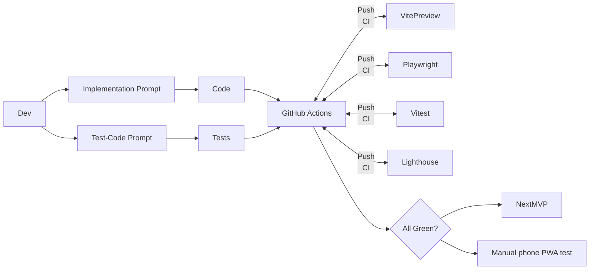

# Perfect Zenkai — Incremental MVP Backlog

Each MVP is a **vertical slice** that delivers user value and leaves the repo in a green‑test state.

## What You Get for Each User Story

- **User Story** – business language description
- **Acceptance Criteria** – "definition of done" 
- **Test Cases** – what automated checks must pass
- **Implementation Prompt** – copy‑paste into Cursor/Claude to generate code
- **Test‑Code Prompt** – copy‑paste to generate matching unit/UI/e2e tests

> **Architecture Rule:** Modules may import **shared** but **never each other**. Shell imports only module **routes**.  
> **Vibe‑coding best‑practice notes appear in *italics* like this.**  
> They are optional enhancements the agent may include.

---

## MVP 0 — Environment & Skeleton

### 0.1 Init Toolkit
**User Story:** *As a dev I want a wired repo so I can `pnpm dev` and see a blank app.*

**Acceptance Criteria:**
- `pnpm dev`, `pnpm test`, `pnpm lint` exit 0
- Prettier & ESLint configs present
- Folder structure follows solution design: `src/app/`, `src/modules/`, `src/shared/`, `src/types/`, `src/test/`

**Test Cases:** CLI checks

**Implementation Prompt:**
```
Create a Vite + React18 + TypeScript project named perfect-zenkai. Add Tailwind 3, shadcn/ui, lucide-react, @vite-pwa/react, ESLint, Prettier, Vitest, Husky, lint‑staged. 

Create folder structure:
src/
├─app/ (AppShell.tsx, routes.ts, NavigationBar.tsx, GlobalFab.tsx)
├─modules/ (weight/, tasks/, dashboard/)
├─shared/ (ui/, hooks/, lib/)
├─types/
└─test/

Return package.json, vite.config.ts, tailwind.config.ts, src/main.tsx (empty <App/>).
```

**Test‑Code Prompt:**
```
Generate src/test/setupTests.ts and src/__tests__/sanity.test.ts that asserts true === true using Vitest.
```

---

### 0.2 PWA Shell
**User Story:** *App is installable and dark‑themed with Perfect Zenkai branding.*

**Acceptance Criteria:**
- `manifest.json` (name "Perfect Zenkai", short_name "Zenkai", icons 192/512, theme #111827)
- Service‑worker registered via @vite-pwa/react
- Lighthouse PWA ≥ 90

**Test Cases:** Lighthouse CI run

**Implementation Prompt:**
```
Add PWA manifest with name "Perfect Zenkai", short_name "Zenkai", theme_color "#111827", background_color "#111827". Generate 192x192 and 512x512 icons. Register service‑worker via virtual:pwa-register in main.tsx. Update index.html theme‑color=#111827. Configure @vite-pwa/react with Workbox.
```

**Test‑Code Prompt:**
```
Create scripts/lighthouse.mjs with @lhci/cli preset=pwa, fail if score<90. Add npm script "lighthouse".
```

---

### 0.3 App Chrome
**User Story:** *Header shows "Perfect Zenkai", empty bottom nav, and inactive FAB are visible.*

**Acceptance Criteria:**
- Header uses shadcn CardHeader with title "Perfect Zenkai"
- Bottom nav uses shadcn NavigationBar fixed `bottom‑0 inset‑x‑0`
- FAB uses Tailwind `fixed bottom-20 right-4 w-14 h-14 rounded-full` with opacity-60
- Layout renders on desktop & phone

**Test Cases:** Playwright bbox snapshot

**Implementation Prompt:**
```
Build src/app/AppShell.tsx with:
- Header using shadcn CardHeader, title "Perfect Zenkai"
- NavigationBar component (empty items) fixed bottom‑0 inset‑x‑0
- GlobalFab component fixed bottom-20 right-4 w-14 h-14 rounded-full bg-primary opacity-60
- Main content area with proper spacing
Use shadcn primitives and Tailwind. Create NavigationBar.tsx and GlobalFab.tsx as separate components.
```

**Test‑Code Prompt:**
```
Playwright test src/test/AppShell.spec.ts — open /, assert Header text "Perfect Zenkai", Nav, Fab visible (boundingBox).
```

---

### 0.4 LAN Docs
**User Story:** *I know how to open the dev app on my phone.*

**Acceptance Criteria:**
- README updated with `pnpm dev -- --host` steps and QR tip

**Test Cases:** –

**Implementation Prompt:**
```
Append a "Mobile Testing" section to README.md explaining:
1. `pnpm dev -- --host` to expose on LAN
2. `npx qrencode -t terminal http://YOUR_IP:5173` for QR code
3. Chrome mobile "Install app" option
```

**Test‑Code Prompt:** –

---

## MVP 1 — Test‑Suite Foundation

### 1.1 Vitest Harness
**User Story:** *I can unit‑test hooks & components easily with proper providers.*

**Acceptance Criteria:**
- `src/test/setupTests.ts` registers RTL + jest‑dom
- `renderWithProviders()` helper adds MemoryRouter + Zustand + Dexie providers
- Coverage gate ≥ 80%
- JSDOM environment configured

**Test Cases:** `pnpm test --coverage` ≥ 80%

**Implementation Prompt:**
```
Create vitest.config.ts with:
- JSDOM environment
- Coverage threshold 80%
- setupFiles pointing to src/test/setupTests.ts

Create src/test/setupTests.ts importing @testing-library/jest-dom.

Implement renderWithProviders(children) wrapper that provides:
- MemoryRouter from react-router-dom
- Zustand store providers (when they exist)
- Any Dexie database providers
```

**Test‑Code Prompt:**
```
Create src/test/Sample.test.tsx — render <button>Hi</button> with renderWithProviders and expect text "Hi" to be in document.
```

---

### 1.2 Playwright Harness
**User Story:** *I can run e2e tests in mobile viewport automatically.*

**Acceptance Criteria:**
- playwright.config.ts default viewport 375×667 & baseURL=http://localhost:5173
- `pnpm test:e2e` spins dev server automatically
- Mobile-first testing approach

**Test Cases:** Sample spec passes

**Implementation Prompt:**
```
Add @playwright/test dependency. Create playwright.config.ts with:
- Mobile viewport 375×667
- baseURL http://localhost:5173
- webServer config to start Vite dev server automatically
- Projects for chromium mobile

Add npm script "test:e2e": "playwright test"
```

**Test‑Code Prompt:**
```
Create e2e/sample.spec.ts — goto '/', expect Header text "Perfect Zenkai", take screenshot sample.png.
```

---

### 1.3 Lighthouse Gate
**User Story:** *Build fails if PWA score dips below 90.*

**Acceptance Criteria:**
- `pnpm lighthouse` exits non‑zero on < 90
- Tests against production build

**Test Cases:** Manual run

**Implementation Prompt:**
```
Create scripts/lighthouse.mjs that:
1. Runs `vite build && vite preview` 
2. Uses @lhci/cli with preset=pwa
3. Asserts PWA score ≥ 90
4. Exits with error code if fails

Add npm script "lighthouse": "node scripts/lighthouse.mjs"
```

**Test‑Code Prompt:** –

---

### 1.4 CI Pipeline
**User Story:** *All PRs run lint, unit, e2e, lighthouse automatically.*

**Acceptance Criteria:**
- GitHub Action passes on push/PR
- Caches pnpm dependencies
- Runs all quality gates

**Test Cases:** GitHub check

**Implementation Prompt:**
```
Create .github/workflows/ci.yml with:
- ubuntu-latest
- Node.js 18
- pnpm cache
- Steps: install, lint, test (with coverage), test:e2e, lighthouse
- Fail fast on any step failure
```

**Test‑Code Prompt:** –

---

## MVP 2 — Weight Module v1 (log & list)

### 2.1 Weight Store + Repo
**User Story:** *I can persist weight data locally with proper module isolation.*

**Acceptance Criteria:**
- Zustand slice in `src/modules/weight/store.ts` (`addWeight`, `deleteWeight`, `weights`)
- Dexie table `weights` in `src/modules/weight/repo.ts`
- WeightEntry type: `{id: string, dateISO: string, kg: number}`
- Hydrates store from Dexie on init
- No cross-module imports

**Test Cases:** Vitest verifying add & hydrate

**Implementation Prompt:**
```
Create src/modules/weight/ folder with:

1. types.ts: export interface WeightEntry {id: string, dateISO: string, kg: number}

2. repo.ts: Dexie database with weights table, functions:
   - addWeight(entry: Omit<WeightEntry, 'id'>)
   - deleteWeight(id: string) 
   - getAllWeights(): Promise<WeightEntry[]>

3. store.ts: Zustand slice with:
   - weights: WeightEntry[]
   - addWeight, deleteWeight, loadWeights actions
   - hydrate() function that loads from repo on init

4. index.ts: export routes, store, types (no internal exports)

Initialize store hydration in main.tsx.
```

**Test‑Code Prompt:**
```
Create src/modules/weight/store.test.ts that:
- Mocks Dexie repo functions
- Tests addWeight action updates store and calls repo
- Tests deleteWeight removes from store
- Tests hydration loads data from repo on init
- Uses renderWithProviders for any React hooks
```

---

### 2.2 Weight Add Sheet
**User Story:** *I can quickly log my weight via FAB sheet.*

**Acceptance Criteria:**
- FAB on /weight routes opens shadcn Sheet
- Form with date input (default today) and kg input (positive numbers only)
- Submit adds entry & closes sheet
- Uses shadcn Sheet component

**Test Cases:** Playwright AddWeight.e2e

**Implementation Prompt:**
```
Create src/modules/weight/components/WeightSheet.tsx using:
- shadcn Sheet component
- Form with date input (default today) and number input for kg
- Validation: kg > 0, date required
- onSubmit calls weight store addWeight action

Update src/app/GlobalFab.tsx to:
- Show when location.pathname startsWith '/weight'
- onClick opens WeightSheet
- Use lucide Plus icon

Wire up the sheet state management between FAB and Sheet.
```

**Test‑Code Prompt:**
```
Create e2e/AddWeight.e2e.ts that:
- Navigates to /weight
- Clicks FAB button
- Fills form with 75kg and today's date
- Submits form
- Expects new weight entry to appear in list
- Verifies sheet closes after submit
```

---

### 2.3 Weight List Page
**User Story:** *I can view and manage my weight history with touch interactions.*

**Acceptance Criteria:**
- `/weight` route lists entries newest‑first
- Each row shows date and kg with proper formatting
- Long‑press row (200ms) → confirm delete dialog
- Uses react-swipeable for touch interactions

**Test Cases:** Playwright DeleteWeight.e2e

**Implementation Prompt:**
```
Create src/modules/weight/pages/WeightPage.tsx with:
- List of weight entries sorted by date (newest first)
- WeightRow component using react-swipeable
- Long-press (200ms) triggers delete confirmation dialog
- Empty state when no weights
- Proper date formatting (e.g., "Dec 15, 2024")
- Weight formatting (e.g., "75.0 kg")

Create src/modules/weight/components/WeightRow.tsx with swipe-to-delete functionality.

Add route to src/modules/weight/routes.ts and export from index.ts.
```

**Test‑Code Prompt:**
```
Create e2e/DeleteWeight.e2e.ts that:
- Adds 2 weight entries via API/store
- Navigates to /weight
- Long-presses first entry (200ms hold)
- Accepts delete confirmation dialog
- Expects list to show only 1 remaining entry
- Verifies correct entry was deleted
```

---

### 2.4 Nav Link
**User Story:** *I can navigate to weight tracking via bottom nav.*

**Acceptance Criteria:**
- Bottom nav shows "Weight" with BarChart3 lucide icon
- Clicking navigates to /weight route
- Active state styling when on weight pages

**Test Cases:** Playwright nav spec

**Implementation Prompt:**
```
Update src/app/NavigationBar.tsx to include:
- Weight nav item with lucide BarChart3 icon
- Text "Weight"
- Active state when pathname startsWith '/weight'
- Proper shadcn NavigationBar styling

Import and merge weightRoutes from src/modules/weight into src/app/routes.ts.

Ensure proper routing setup with React Router.
```

**Test‑Code Prompt:**
```
Create e2e/NavToWeight.e2e.ts that:
- Starts on dashboard (/)
- Clicks "Weight" nav icon
- Expects pathname to be '/weight'
- Verifies nav item shows active state
- Verifies WeightPage content is visible
```

---

## MVP 3 — Tasks Module v1 (to‑dos)

### 3.1 Tasks Store + Repo
**User Story:** *I can persist tasks locally with full CRUD operations.*

**Acceptance Criteria:**
- Zustand + Dexie following same pattern as weight module
- Todo type: `{id: string, text: string, done: boolean, createdAt: string}`
- Full CRUD methods with proper error handling

**Test Cases:** Vitest

**Implementation Prompt:**
```
Create src/modules/tasks/ folder with same structure as weight:

1. types.ts: export interface Todo {id: string, text: string, done: boolean, createdAt: string}

2. repo.ts: Dexie database with todos table:
   - addTodo(todo: Omit<Todo, 'id'>)
   - updateTodo(id: string, updates: Partial<Todo>)
   - deleteTodo(id: string)
   - getAllTodos(): Promise<Todo[]>

3. store.ts: Zustand slice with:
   - todos: Todo[]
   - addTodo, updateTodo, deleteTodo, loadTodos actions
   - hydrate() function

4. index.ts: export routes, store, types

Initialize in main.tsx.
```

**Test‑Code Prompt:**
```
Create src/modules/tasks/store.test.ts that:
- Tests all CRUD operations
- Tests toggle done functionality
- Tests hydration from repo
- Mocks Dexie properly
- Uses renderWithProviders for React hooks
```

---

### 3.2 Todo Page
**User Story:** *I can manage my tasks offline with intuitive interactions.*

**Acceptance Criteria:**
- `/todo` route with input to add new todos
- Checkbox to toggle completion status
- Swipe-to-delete functionality
- Works offline with Dexie persistence
- Shows completed vs incomplete todos

**Test Cases:** Playwright TodoOffline.e2e (offline persistence)

**Implementation Prompt:**
```
Create src/modules/tasks/pages/TodoPage.tsx with:
- Input field to add new todos (Enter to submit)
- TodoRow components with:
  - Checkbox for done/undone toggle
  - Text with strikethrough when completed
  - react-swipeable for delete
- Separate sections for incomplete and completed todos
- Empty states for each section

Create src/modules/tasks/components/TodoRow.tsx with proper touch interactions.

Add routes to src/modules/tasks/routes.ts.
```

**Test‑Code Prompt:**
```
Create e2e/TodoOffline.e2e.ts that:
- Goes offline (network disabled)
- Navigates to /todo
- Adds new todo via input
- Toggles todo completion status
- Deletes a todo via swipe
- Reloads page while offline
- Expects all changes to persist
- Goes back online and verifies data integrity
```

---

### 3.3 Nav & FAB wiring
**User Story:** *I can navigate to tasks and access quick actions.*

**Acceptance Criteria:**
- Bottom nav "Tasks" with CheckSquare lucide icon
- FAB shows on /todo routes with appropriate action
- Proper active state styling

**Test Cases:** Playwright nav spec

**Implementation Prompt:**
```
Update src/app/NavigationBar.tsx to add:
- Tasks nav item with lucide CheckSquare icon
- Text "Tasks"
- Active state when pathname startsWith '/todo'

Update src/app/GlobalFab.tsx to:
- Show on /todo routes
- Focus on todo input when clicked (or show add todo sheet)
- Use appropriate icon (Plus or PlusCircle)

Merge taskRoutes into src/app/routes.ts.
```

**Test‑Code Prompt:**
```
Create e2e/NavToTasks.e2e.ts that:
- Clicks "Tasks" nav icon from dashboard
- Expects pathname '/todo'
- Verifies TodoPage renders
- Tests FAB functionality on todo page
- Verifies nav active state
```

---

## MVP 4 — Dashboard Module (home cards)

### 4.1 Sparkline Card
**User Story:** *I can see my weight trend at a glance with interactive chart.*

**Acceptance Criteria:**
- Shows last 30 days weight data as sparkline
- Uses React.lazy to load Recharts
- Click navigates to /weight
- Handles empty data gracefully

**Test Cases:** Vitest SVG path present

**Implementation Prompt:**
```
Create src/modules/dashboard/components/WeightSparkCard.tsx with:
- shadcn Card with rounded-2xl shadow-sm
- React.lazy loaded Recharts LineChart/Sparkline
- Last 30 days of weight data from weight store
- Loading state while chart loads
- Empty state with placeholder when no data
- onClick handler to navigate to /weight
- Proper responsive sizing

Use Recharts with minimal styling for clean sparkline appearance.
```

**Test‑Code Prompt:**
```
Create src/modules/dashboard/WeightSparkCard.test.tsx that:
- Renders with 3 mock weight entries
- Expects SVG path element to be present
- Tests loading state
- Tests empty state
- Tests click navigation
- Mocks Recharts properly
```

---

### 4.2 Today Weight Card
**User Story:** *I can see today's weight status prominently.*

**Acceptance Criteria:**
- Displays latest weight entry or placeholder
- Shows date and weight with proper formatting
- Indicates if no weight logged today
- Links to weight entry

**Test Cases:** Jest DOM

**Implementation Prompt:**
```
Create src/modules/dashboard/components/TodayWeightCard.tsx with:
- shadcn Card styling
- Reads latest weight entry from weight store
- Shows "Today: 75.0 kg" or "No weight logged today"
- Proper date comparison for "today"
- Click to navigate to /weight
- Loading state while data loads
```

**Test‑Code Prompt:**
```
Create src/modules/dashboard/TodayWeightCard.test.tsx that:
- Tests with today's weight entry
- Tests with no weight today
- Tests with weight from yesterday
- Verifies placeholder text
- Tests click navigation
```

---

### 4.3 Todo Summary Card
**User Story:** *I can see my task progress at a glance.*

**Acceptance Criteria:**
- Shows count of incomplete todos
- Shows total todos count
- Progress indicator or percentage
- Links to todo page

**Test Cases:** Jest DOM

**Implementation Prompt:**
```
Create src/modules/dashboard/components/TodoSummaryCard.tsx with:
- shadcn Card styling
- Reads todos from tasks store
- Shows "3 of 5 tasks complete" format
- Progress bar or circular progress indicator
- Click to navigate to /todo
- Handles zero todos gracefully
```

**Test‑Code Prompt:**
```
Create src/modules/dashboard/TodoSummaryCard.test.tsx that:
- Tests count calculation with mixed todos
- Tests with all completed todos
- Tests with no todos
- Verifies count increments properly
- Tests click navigation
```

---

### 4.4 Streak Card (stub)
**User Story:** *I can see my consistency streak placeholder.*

**Acceptance Criteria:**
- Static "0 day streak" for now
- Proper card styling matching other cards
- Placeholder for future streak logic

**Test Cases:** Jest DOM

**Implementation Prompt:**
```
Create src/modules/dashboard/components/StreakCard.tsx with:
- shadcn Card styling matching other cards
- Static text "0 day streak"
- Placeholder icon (Calendar or Flame)
- Same click behavior as other cards (maybe to settings)
- Comment indicating future enhancement
```

**Test‑Code Prompt:**
```
Create src/modules/dashboard/StreakCard.test.tsx that:
- Renders placeholder text "0 day streak"
- Tests card styling consistency
- Placeholder for future streak logic tests
```

---

### 4.5 Dashboard Page
**User Story:** *I have a useful home screen with responsive card layout.*

**Acceptance Criteria:**
- `/` route shows dashboard
- Grid: 1‑col <640px, 2‑col ≥640px
- All four cards properly arranged
- Responsive and mobile-friendly

**Test Cases:** Playwright responsive spec

**Implementation Prompt:**
```
Create src/modules/dashboard/pages/DashboardPage.tsx with:
- CSS Grid layout: grid-cols-1 sm:grid-cols-2
- Gap between cards
- All four cards: WeightSparkCard, TodayWeightCard, TodoSummaryCard, StreakCard
- Proper padding and margins
- Mobile-first responsive design

Create src/modules/dashboard/routes.ts with dashboard route.

Add to src/modules/dashboard/index.ts exports.
```

**Test‑Code Prompt:**
```
Create e2e/DashboardResponsive.e2e.ts that:
- Tests viewport 500px (mobile) - expects 1 column
- Tests viewport 800px (desktop) - expects 2 columns
- Verifies all 4 cards are visible
- Tests card click navigation
- Takes screenshots at different viewports
```

---

### 4.6 Default Route & Header
**User Story:** *App opens to dashboard with proper branding.*

**Acceptance Criteria:**
- App opens to dashboard by default
- Header shows "Perfect Zenkai" title
- Proper routing setup

**Test Cases:** Smoke test

**Implementation Prompt:**
```
Update src/app/routes.ts to:
- Set default route "/" to DashboardPage
- Import and merge dashboardRoutes
- Ensure proper React Router setup

Update src/app/AppShell.tsx header to show "Perfect Zenkai" title consistently.

Verify all module routes are properly integrated.
```

**Test‑Code Prompt:** –

---

## MVP 5 — Offline Polish

### 5.1 Runtime Cache
**User Story:** *App works seamlessly offline with proper caching.*

**Acceptance Criteria:**
- Images and JSON cached via Workbox
- App shell cached for offline use
- Data persists offline via Dexie

**Test Cases:** Playwright OfflineWeight.e2e

**Implementation Prompt:**
```
Extend @vite-pwa/react configuration in vite.config.ts with:
- workbox.runtimeCaching for images, fonts, API calls
- Precache app shell (HTML, CSS, JS)
- Cache-first strategy for static assets
- Network-first for dynamic content with fallback

Update service worker registration to handle updates properly.
```

**Test‑Code Prompt:**
```
Create e2e/OfflineWeight.e2e.ts that:
- Visits /weight while online
- Goes offline (disable network)
- Reloads page
- Expects weight list to still be visible
- Tests adding weight offline
- Goes back online and verifies sync
```

---

### 5.2 Online Status Banner
**User Story:** *I know when I'm offline with clear visual indicator.*

**Acceptance Criteria:**
- useOnline hook detects connection status
- Red banner appears when offline
- Banner disappears when back online

**Test Cases:** Vitest hook; Playwright toggle offline

**Implementation Prompt:**
```
Create src/shared/hooks/useOnline.ts that:
- Uses navigator.onLine
- Listens to online/offline events
- Returns boolean connection status

Create src/app/components/OfflineBanner.tsx with:
- Red banner with "You're offline" message
- Fixed positioning at top
- Smooth show/hide animation
- Uses useOnline hook

Add OfflineBanner to AppShell.tsx.
```

**Test‑Code Prompt:**
```
Create src/shared/hooks/useOnline.test.ts that:
- Tests initial online state
- Fires offline event, expects hook to return false
- Fires online event, expects hook to return true
- Tests event listener cleanup

Create e2e test for banner visibility when toggling offline.
```

---

## MVP 6 — Engagement (push + install)

### 6.1 Daily Reminder
**User Story:** *I get reminded to track my weight daily.*

**Acceptance Criteria:**
- At 9 AM if no weight logged today, push notification "Time to weigh in"
- Requests notification permission on first /weight visit
- Respects user's notification preferences

**Test Cases:** Service‑worker push simulation

**Implementation Prompt:**
```
Update service worker (sw.ts) to add:
- scheduleDailyReminder() function using setTimeout until next 9am
- Check if weight logged today before sending notification
- Notification payload: "Time to weigh in" with Perfect Zenkai icon

Add notification permission request to WeightPage on first visit.

Handle notification click to open /weight route.
```

**Test‑Code Prompt:**
```
Create e2e/PushReminder.e2e.ts that:
- Mocks service worker push event
- Triggers daily reminder logic
- Asserts notification payload contains correct text
- Tests notification click behavior
- Verifies permission request flow
```

---

### 6.2 Custom Install Prompt
**User Story:** *I'm prompted to install the app at the right time.*

**Acceptance Criteria:**
- After 30s of first visit, Sheet asks to install
- "Install" button calls `event.prompt()`
- "Later" button remembers choice in localStorage
- Doesn't show again if previously declined

**Test Cases:** Playwright InstallPrompt.e2e

**Implementation Prompt:**
```
Create src/shared/hooks/useDeferredInstallPrompt.ts that:
- Captures beforeinstallprompt event
- Manages install prompt state
- Handles user choice persistence

Create src/app/components/InstallSheet.tsx with:
- shadcn Sheet component
- "Install Perfect Zenkai" title
- "Install" and "Later" buttons
- Auto-shows after 30s on first visit
- Respects previous "Later" choice

Add to AppShell.tsx with proper timing logic.
```

**Test‑Code Prompt:**
```
Create e2e/InstallPrompt.e2e.ts that:
- Waits 35 seconds on first visit
- Expects InstallSheet to be visible
- Clicks "Later" button
- Reloads page
- Expects Sheet NOT to show again
- Tests "Install" button triggers prompt
```

---

## Enhancement Ideas (optional for AI agent)

- **Commitizen + Conventional Commits** – consistent commit messages for auto‑changelog
- **Storybook** – isolate shadcn cards for visual regression testing
- **TypeDoc** – generate API docs for shared/lib functions
- **lint‑staged** – format/compile only changed files on commit
- **Pre‑push hook** – run `pnpm test:e2e` before remote push to catch breakage locally
- **Supabase Integration** – real-time sync and auth for multi-device usage
- **Advanced Streak Logic** – calculate actual consistency streaks
- **Data Export** – CSV/JSON export functionality
- **Themes** – multiple color schemes beyond dark mode

---

## Workflow Summary



**Ship one MVP → all gates pass → install on phone → move on. Happy building!**
